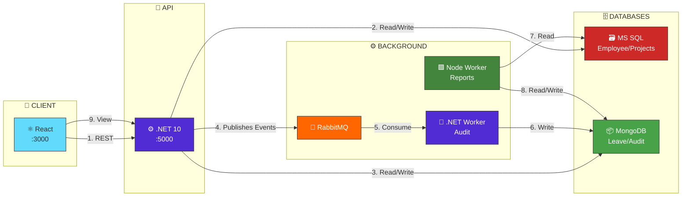

# Workforce Management Platform


A full-stack, event-driven workforce platform leveraging .NET 10, React TypeScript, dual databases (SQL Server + MongoDB), RabbitMQ messaging, and Docker containerization.

## Quick Start

### Prerequisites
- Docker Desktop
- .NET 10 SDK
- Node.js 20+
  
```bash
git clone https://github.com/astro05/workforce-platform.git
cd workforce-platform
docker compose up --build
```

## Service URLs

| Service | URL |
|---|---|
| Frontend | http://localhost:3000 |
| API | http://localhost:5000 |
| API Swagger | http://localhost:5000/swagger |
| RabbitMQ UI | http://localhost:15672 |

## Environment Variables

| Variable | Default | Description |
|---|---|---|
| `SA_PASSWORD` | `Workforce_Pass123` | SQL Server password |
| `MONGO_USER` | `mongo_user` | MongoDB username |
| `MONGO_PASSWORD` | `mongo_pass` | MongoDB password |
| `RABBITMQ_USER` | `admin` | RabbitMQ username |
| `RABBITMQ_PASSWORD` | `admin123` | RabbitMQ password |

---
## System Architecture


----

## Tech Stack

| Layer | Technology |
|---|---|
| API | .NET 10, ASP.NET Core, EF Core |
| Frontend | React 18, TypeScript, Vite, Ant Design |
| SQL Database | SQL Server 2022 |
| Document Database | MongoDB 7 |
| Message Broker | RabbitMQ 3 |
| Audit Worker | .NET 10 Background Worker |
| Report Worker | Node.js 20 |
| Container | Docker + Docker Compose |
| CI/CD | GitHub Actions |

---

## Technology Choices & Justification

### .NET 10 (API Server & Worker 1)
.NET 10 powers both the API server and Worker 1, chosen for its high-performance compiled runtime, strong type safety, and mature ecosystem. Built-in dependency injection promotes clean architecture, while excellent client libraries for EF Core, MongoDB, and RabbitMQ enable seamless integration. The robust background service implementation with health checks makes it ideal for reliable audit log processing.

### MS SQL Server
MS SQL Server handles all relational data (employees, departments, projects, tasks) where ACID compliance and referential integrity are essential. Its optimized query engine efficiently manages complex joins across related entities, while Entity Framework Core integration simplifies development. For payroll and project data where consistency is critical, SQL Server's proven reliability was the clear choice.

### MongoDB
MongoDB stores leave requests, audit logs, and summary reports—domains where flexible schemas and embedded documents excel. Leave requests embed complete approval histories within single documents, eliminating complex joins. High write throughput handles thousands of audit events, while the aggregation pipeline simplifies report generation. A natural fit for document-oriented operational data.

### RabbitMQ
RabbitMQ serves as the message broker, enabling event-driven communication between services. It reliably distributes domain events to both workers with support for dead letter queues and idempotent consumers. The management UI provides visibility into message flows, while excellent client libraries for both .NET and Node.js ensure seamless integration across the polyglot architecture.

### Node.js for Report Worker
Node.js powers Worker 2 (Report Scheduler), leveraging its non-blocking I/O model for efficient scheduled jobs and data aggregation. The rich npm ecosystem provides mature scheduling libraries and reporting tools, while its smaller container footprint complements the polyglot architecture. Perfect for I/O-heavy reporting tasks where development speed matters.

### React + TypeScript
React with TypeScript delivers a responsive single-page application with component reusability across employee, project, and leave views. TypeScript adds type safety, reducing runtime errors and improving developer experience. Material-UI accelerates development with pre-built components, while React Query simplifies server state management—resulting in a polished, maintainable frontend.

---

# API Endpoints

| Method | Path | Description |
|--------|------|-------------|
| **Audit Logs** |||
| `GET` | `/api/v1/auditlogs` | Get recent audit logs or logs by entity (use query params) |
| `GET` | `/api/v1/auditlogs/{aggregateType}/{aggregateId}` | Get audit logs for a specific entity by type and ID |
| `POST` | `/api/v1/auditlogs` | Insert a new audit log (used internally by workers) |
| **Dashboard** |||
| `GET` | `/api/v1/dashboard` | Get the latest dashboard report |
| **Departments** |||
| `GET` | `/api/v1/departments` | Get all departments |
| `GET` | `/api/v1/departments/{id}` | Get a department by ID |
| `POST` | `/api/v1/departments` | Create a new department |
| `PUT` | `/api/v1/departments/{id}` | Update an existing department by ID |
| `DELETE` | `/api/v1/departments/{id}` | Delete a department by ID |
| **Designations** |||
| `GET` | `/api/v1/designations` | Get all designations |
| `GET` | `/api/v1/designations/{id}` | Get a designation by ID |
| `POST` | `/api/v1/designations` | Create a new designation |
| `PUT` | `/api/v1/designations/{id}` | Update an existing designation by ID |
| `DELETE` | `/api/v1/designations/{id}` | Delete a designation by ID |
| **Employees** |||
| `GET` | `/api/v1/employees` | Get all employees (supports query params for paging/filtering) |
| `GET` | `/api/v1/employees/{id}` | Get an employee by ID |
| `POST` | `/api/v1/employees` | Create a new employee |
| `PUT` | `/api/v1/employees/{id}` | Update an existing employee by ID |
| `DELETE` | `/api/v1/employees/{id}` | Delete (soft-delete) an employee by ID |
| **Leave Requests** |||
| `GET` | `/api/v1/leaverequests` | Get all leave requests (supports query params) |
| `GET` | `/api/v1/leaverequests/employee/{employeeId}` | Get leave requests for a specific employee |
| `GET` | `/api/v1/leaverequests/{id}` | Get a leave request by ID |
| `POST` | `/api/v1/leaverequests` | Create a new leave request |
| `PUT` | `/api/v1/leaverequests/{id}/status` | Update the status of a leave request |
| `PUT` | `/api/v1/leaverequests/{id}/cancel` | Cancel a leave request (requires ActorName query) |
| **Projects** |||
| `GET` | `/api/v1/projects` | Get all projects |
| `GET` | `/api/v1/projects/{id}` | Get a project by ID |
| `POST` | `/api/v1/projects` | Create a new project |
| `PUT` | `/api/v1/projects/{id}` | Update an existing project by ID |
| `POST` | `/api/v1/projects/{id}/members` | Add a member to a project |
| `DELETE` | `/api/v1/projects/{id}/members/{employeeId}` | Remove a member from a project by employee ID |
| **Tasks** |||
| `GET` | `/api/v1/tasks?projectId={id}` | Get all tasks for a specific project (requires ProjectId query param) |
| `GET` | `/api/v1/tasks/{id}` | Get a task by ID |
| `POST` | `/api/v1/tasks` | Create a new task |
| `PUT` | `/api/v1/tasks/{id}` | Update an existing task by ID |
| `PATCH` | `/api/v1/tasks/{id}/status` | Update the status of a task by ID |
| `DELETE` | `/api/v1/tasks/{id}` | Delete a task by ID |

---

## Third-Party Library Justifications

| Library | Used In | Reason |
|---|---|---|
| `Microsoft.EntityFrameworkCore.SqlServer` | API | Standard EF Core provider for SQL Server, best-in-class .NET ORM |
| `MongoDB.Driver` | API, Audit Worker | Official MongoDB .NET driver, strong LINQ support |
| `RabbitMQ.Client` | API, Audit Worker | Official RabbitMQ .NET client, v7 async-first API |
| `Polly` | Audit Worker | Industry standard .NET resilience library for retry policies |
| `Serilog` | API, Audit Worker | Structured logging with multiple sinks, better than default ILogger for production |
| `mssql` | Report Worker | Most widely used SQL Server client for Node.js |
| `mongodb` | Report Worker | Official MongoDB Node.js driver |
| `node-cron` | Report Worker | Simple, reliable cron scheduling for Node.js |
| `pino` | Report Worker | Fastest structured JSON logger for Node.js |
| `axios` | Frontend | Most popular HTTP client for React, interceptor support |
| `@tanstack/react-query` | Frontend | Best-in-class server state management for React |
| `antd` | Frontend | Comprehensive enterprise React UI component library |
| `recharts` | Frontend | Composable chart library built on D3, React-native API |
| `dayjs` | Frontend | Lightweight Moment.js replacement for date formatting |
| `react-router-dom` | Frontend | Standard routing library for React SPAs |

---

### Known Limitations
- **Security:** Operates without Authentication/Authorization; all endpoints are currently public (JWT implementation planned for production).

- **Database Schema:** Utilizes hand-written EF Core migration files rather than the standard dotnet ef migrations CLI workflow.

- **Resiliency:** The Node.js worker relies on basic polling retries; production would require Dead-Letter Queues (DLQ) for robust error handling.

- **Testing:** End-to-End (E2E) testing is currently absent (Playwright is the intended tool for future stack validation).

- **Performance:** All list views are optimized with Server-Side Pagination to handle large datasets efficiently.

