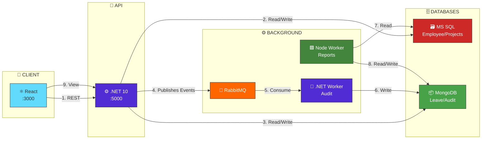

# Workforce Management Platform


A full-stack, event-driven workforce platform leveraging .NET 10, React TypeScript, dual databases (SQL Server + MongoDB), RabbitMQ messaging, and Docker containerization.

## Quick Start

### Prerequisites
- Docker Desktop
- .NET 10 SDK
- Node.js 20+
  
```bash
git clone https://github.com/astro05/workforce-platform.git
cd workforce-platform
docker compose up --build
```

## Service URLs

| Service | URL |
|---|---|
| Frontend | http://localhost:3000 |
| API | http://localhost:5000 |
| API Swagger | http://localhost:5000/swagger |
| RabbitMQ UI | http://localhost:15672 |

## Environment Variables

| Variable | Default | Description |
|---|---|---|
| `SA_PASSWORD` | `Workforce_Pass123` | SQL Server password |
| `MONGO_USER` | `mongo_user` | MongoDB username |
| `MONGO_PASSWORD` | `mongo_pass` | MongoDB password |
| `RABBITMQ_USER` | `admin` | RabbitMQ username |
| `RABBITMQ_PASSWORD` | `admin123` | RabbitMQ password |

---
## System Architecture


----

## Tech Stack

| Layer | Technology |
|---|---|
| API | .NET 10, ASP.NET Core, EF Core |
| Frontend | React 18, TypeScript, Vite, Ant Design |
| SQL Database | SQL Server 2022 |
| Document Database | MongoDB 7 |
| Message Broker | RabbitMQ 3 |
| Audit Worker | .NET 10 Background Worker |
| Report Worker | Node.js 20 |
| Container | Docker + Docker Compose |
| CI/CD | GitHub Actions |

---

## Technology Choices & Justification

### .NET 10 (API Server & Worker 1)
.NET 10 powers both the API server and Worker 1, chosen for its high-performance compiled runtime, strong type safety, and mature ecosystem. Built-in dependency injection promotes clean architecture, while excellent client libraries for EF Core, MongoDB, and RabbitMQ enable seamless integration. The robust background service implementation with health checks makes it ideal for reliable audit log processing.

### MS SQL Server
MS SQL Server handles all relational data (employees, departments, projects, tasks) where ACID compliance and referential integrity are essential. Its optimized query engine efficiently manages complex joins across related entities, while Entity Framework Core integration simplifies development. For payroll and project data where consistency is critical, SQL Server's proven reliability was the clear choice.

### MongoDB
MongoDB stores leave requests, audit logs, and summary reports—domains where flexible schemas and embedded documents excel. Leave requests embed complete approval histories within single documents, eliminating complex joins. High write throughput handles thousands of audit events, while the aggregation pipeline simplifies report generation. A natural fit for document-oriented operational data.

### RabbitMQ
RabbitMQ serves as the message broker, enabling event-driven communication between services. It reliably distributes domain events to both workers with support for dead letter queues and idempotent consumers. The management UI provides visibility into message flows, while excellent client libraries for both .NET and Node.js ensure seamless integration across the polyglot architecture.

### Node.js for Report Worker
Node.js powers Worker 2 (Report Scheduler), leveraging its non-blocking I/O model for efficient scheduled jobs and data aggregation. The rich npm ecosystem provides mature scheduling libraries and reporting tools, while its smaller container footprint complements the polyglot architecture. Perfect for I/O-heavy reporting tasks where development speed matters.

### React + TypeScript
React with TypeScript delivers a responsive single-page application with component reusability across employee, project, and leave views. TypeScript adds type safety, reducing runtime errors and improving developer experience. Material-UI accelerates development with pre-built components, while React Query simplifies server state management—resulting in a polished, maintainable frontend.
